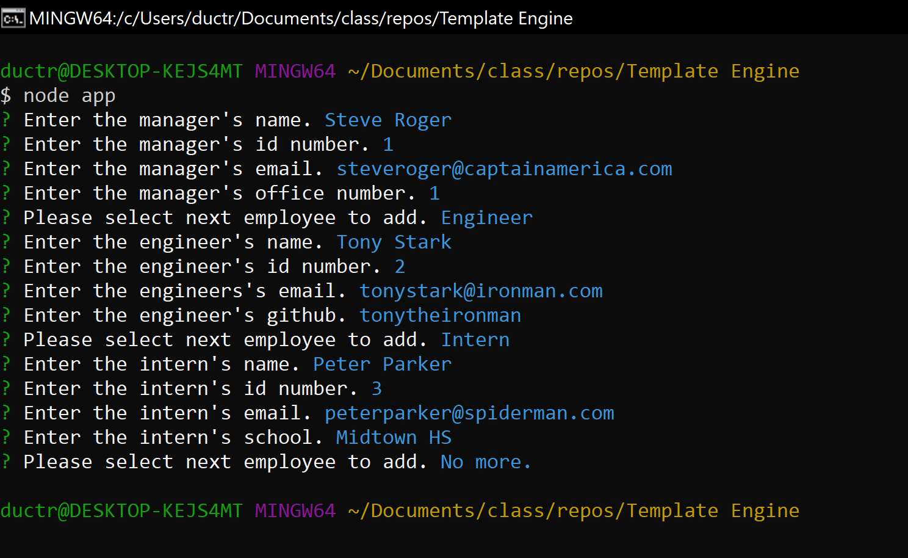
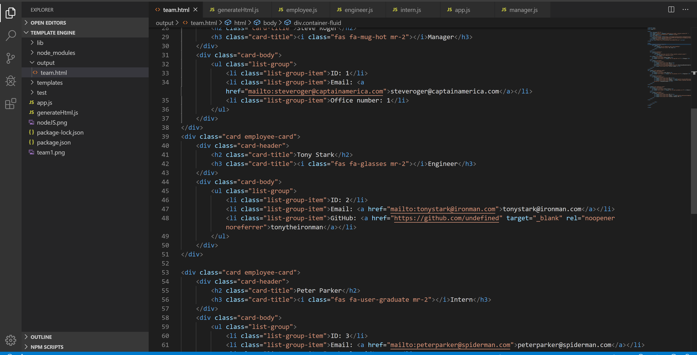

# Team Template Engine

#### Purpose

The purpose of this project is to be able to use class constructor and extended to other files so that we are able to acess data/files of the javascript file we extended to and use user inputs to generate an html of all the team profile according to user inputs.

#### Functionality

The functionality of this project is to develop a team profile according to user input so it is easier for managers to keep track of their employee, and be able to have access to their contact information.

Users can input as many employees as they want, and the application should generate it accordingly.

#### Link to deployed github application: 

https://ductran963.github.io/teamTemplateEngine/

#### Node JS Demo

#### Generated HTML

#### Team Profile HTML

